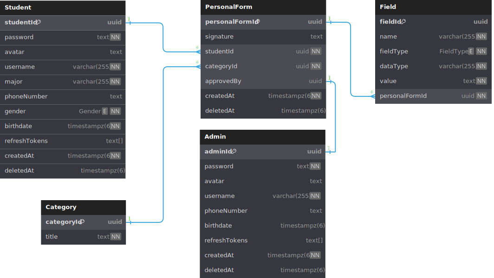

# Student forms management apis


||

BE server for [Student form management mobile app](./templates/.env.template). This project uses Expressjs, Typescript and Tesseract
**_CT6_**

||

---

## ⇁ Requirements

python3, tesseract-ocr installed

you can install tesseract with the following command (for linux distribution with `apt` package manager only. For other platforms, [read this](https://github.com/UB-Mannheim/tesseract/wiki))

```shell
npm run ocr
```

## ⇁ List of environment variables

| Variable      | Required | Purpose                                                                                      |
| ------------- | -------- | -------------------------------------------------------------------------------------------- |
| DATABASE_URL  | YES      | your choosen database url                                                                    |
| AT_SECRET_KEY | YES      | use to generate, verify accesstoken                                                          |
| RT_SECRET_KEY | YES      | use to generate, verify refreshtoken                                                         |
| PORT          | NO       | port to run project, it is set to `8000` by default                                          |
| NODE_ENV      | NO       | environment, can take value of `development` or `production`, default value is `development` |
| CLIENT_DOMAIN | NO       | client domain, need to specify to pass CORS                                                  |
| CLIENT_PORT   | NO       | client port, like `CLIENT_DOMAIN` but used to develop in local                               |

For the full .env file example, check
out [this template](./templates/.env.template) <br>

## ⇁ Development

first, clone this project<br>
next, config your .env file<br>
then setup prisma:

```shell
npm run db-generate
```

you can check the invalid code with this command:

```shell
npm run lint
```

you can run the development server in local by this command:

```shell
npm run dev
```

you can test app in production environment by running:

```shell
npm run build
npm run start
```

## ⇁ Database schema



## ⇁ Docker

```shell
make build
make server
```
